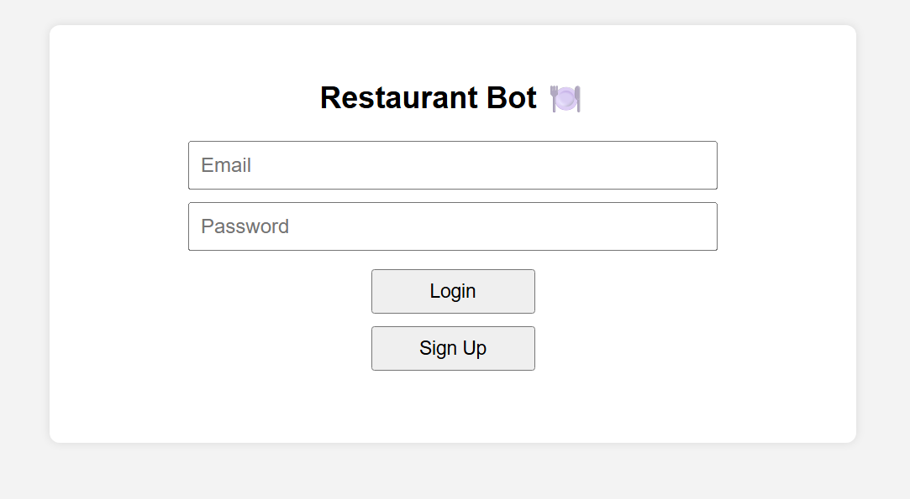
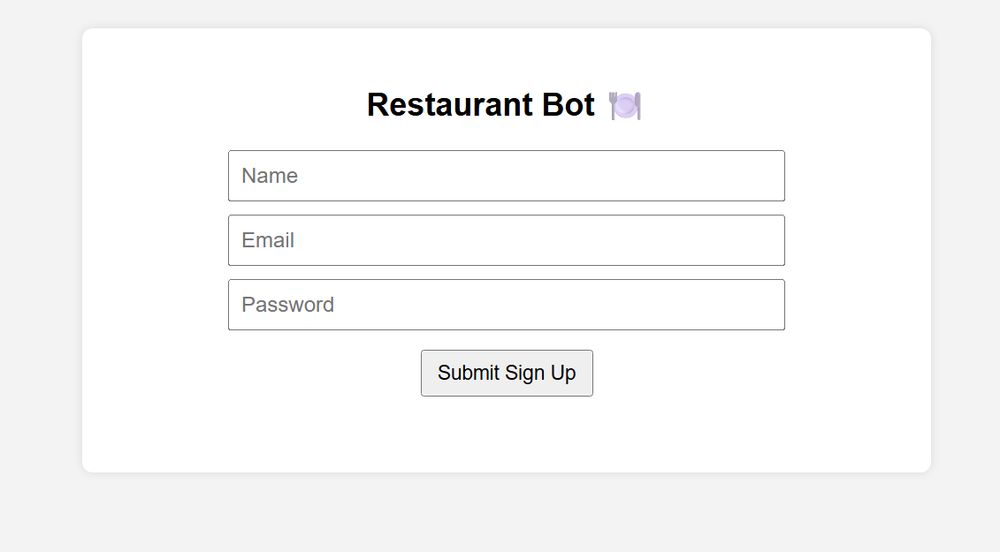
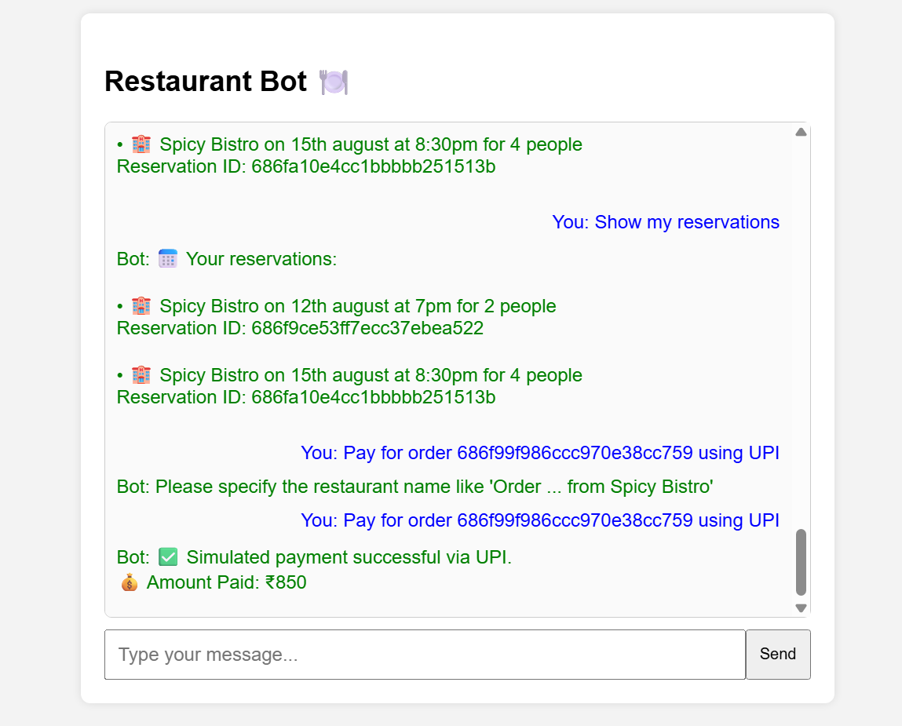

# 🍽️ Restaurant ChatBot

A smart, user-friendly restaurant chatbot built with **Node.js** and **MongoDB**, designed to simplify your dining experience. From restaurant discovery to ordering food and tracking reservations — everything happens in a clean chat interface!

---

## 📸 Screenshots

<h3>🔐 Login Screen</h3>


<h3>🧾 Sign Up Screen</h3>


<h3>💬 Bot Interface (After Login)</h3>


---

### 🚀 Demo Link: [https://restaurant-bot-eiqq.onrender.com](https://restaurant-bot-eiqq.onrender.com)

---

## ⚙️ Tech Stack

| Layer           | Technology                 |
|----------------|----------------------------|
| Frontend       | HTML, CSS, Vanilla JS      |
| Backend        | Node.js, Express.js        |
| Database       | MongoDB (MongoDB Atlas)    |
| Authentication | JWT (JSON Web Tokens)      |
| Deployment     | Render                     |

---

## ✨ Features

- 🔐 **Authentication System**
  - Sign Up, Login, Logout with JWT session storage.
  - Protected chatbot access only after login.

- 🍴 **Restaurant Discovery**
  - Search by cuisine, city, or price range.

- 📝 **Menu Exploration**
  - View full menus of selected restaurants.

- 📆 **Reservation Management**
  - Book tables with date/time and party size.
  - View or cancel existing reservations.

- 🛒 **Ordering**
  - Place delivery or pickup orders via chat.
  - Quantity-based ordering and address parsing.

- 📦 **Order Tracking**
  - Get real-time updates on your placed orders.

- 💳 **Simulated UPI Payment**
  - Test payment for orders (no real gateway used).

- 🎯 **Personalized Experience**
  - Sessions stored using token until logged out.

---

## 🛠️ Installation & Setup

```bash
# 1. Clone the repo
git clone https://github.com/yourusername/restaurant-bot.git
cd restaurant-bot

# 2. Install dependencies
npm install

# 3. Create a .env file and add:
MONGODB_URI=<your_mongodb_atlas_connection_string>
JWT_SECRET=<your_jwt_secret>

# 4. Run the server
node server.js

# 5. Access the app
Open http://localhost:5000
